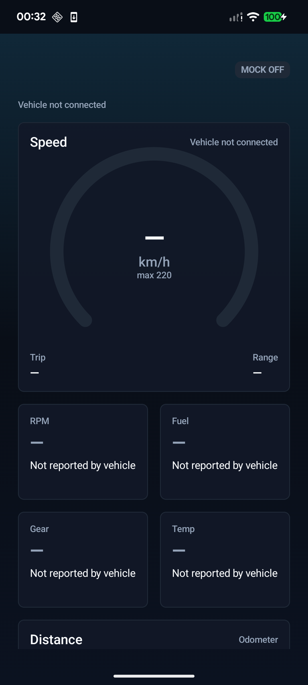
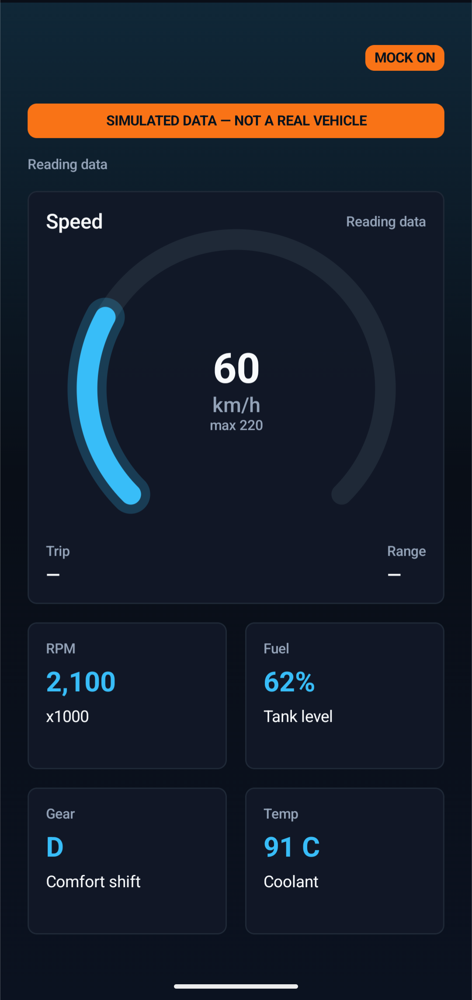
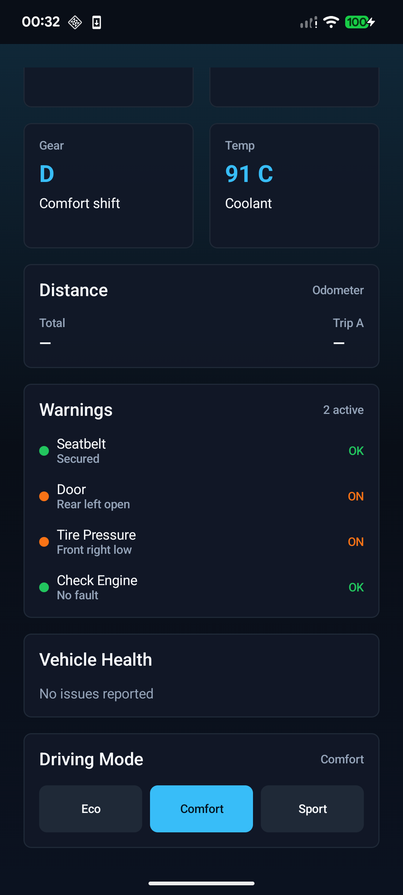

# Car Dashboard

An Android instrument cluster built with Kotlin and Jetpack Compose. It renders speed, revs, coolant
temperature, fuel level, distance, drive mode and vehicle warnings on a dark, adaptive screen, and it
is built around a single rule: **the dashboard never shows a number that a data source did not
actually report.**

> **This build cannot read a real vehicle yet.** The USB transport that would talk to an OBD-II
> adapter is not implemented — the interface and the whole protocol stack above it are, but no bytes
> flow. With no real source present the app shows an honest empty state, and a debug-only mock source
> can be switched on for development. See [Current status](#current-status).

## Screenshots

| Disconnected — the honest empty state | Mock mode — clearly labelled | Warnings and health |
| --- | --- | --- |
|  |  |  |

Note the difference between the two states. Disconnected shows an em dash and
*"Not reported by vehicle"* for every field — never a zero. Mock mode carries a permanent
`SIMULATED DATA — NOT A REAL VEHICLE` banner and a `MOCK ON` chip, so simulated values can never be
mistaken for real ones.

## The data-integrity rules

These are enforced by the type system and by tests, not by convention:

- **No placeholder values.** Every measurement is a `Signal<T>`, which is either a real reading, or a
  stated reason there is no reading. There is no numeric default anywhere in the vehicle domain — a
  field can only hold a number because a source reported one.
- **No cross-signal inference.** The app will not derive one reading from another (for example,
  estimating range from fuel level), because the result would be presented with the same confidence
  as a measured value.
- **No inferred diagnosis.** A fault is shown only when the vehicle reports a diagnostic trouble
  code. A missing reading is never rendered as "OK".
- **Discovery failure is not a capability.** If the app cannot determine whether a vehicle supports a
  reading, that is reported as unknown — not as unsupported, and not as zero.
- **Simulated data is always labelled**, and mock mode can never be reached in a release build.

### Signal semantics

| State | Meaning | Shown as |
| --- | --- | --- |
| `Signal.Value(v, t)` | A reading that genuinely came from the active source, with its timestamp | The value |
| `Signal.Unknown` | The source may be able to provide this, but no reading has arrived yet | `—` + *"Not reported by vehicle"* |
| `Signal.Unsupported` | The **currently selected source** has determined it cannot provide this field | `—` + *"Not available from this source"* |

`Unsupported` is deliberately scoped to the source, not to the vehicle. A generic OBD-II source
cannot read seatbelt status; a future manufacturer-specific source might. Nothing in the UI contract
would have to change.

## Architecture

Unidirectional data flow with manual dependency injection — no DI framework.

```
Compose UI          DashboardScreen / DiagnosticDetailScreen
   ▲ state          stateless, render a DashboardUiState
   │
ViewModel           DashboardViewModel — StateFlow, viewModelScope
   ▲
Repository          VehicleRepository — source selection, staleness, logging
   ▲
Data source         VehicleDataSource
                      ├─ MockVehicleDataSource   debug builds only, always labelled
                      └─ ObdVehicleDataSource    capability discovery + polling loops
   ▲
Protocol            Elm327Session — framing, handshake, error replies, timeouts
   ▲
Transport           VehicleTransport (interface)   ← not implemented yet
```

Packages under `com.csjotlab.cardashboard`:

| Package | Contents |
| --- | --- |
| `vehicle.domain` | `Signal`, `VehicleState`, `Diagnostics`, connection states, `Clock` |
| `vehicle.protocol` | `Elm327Session`, `ObdCommand`, `ObdPid`, `SupportedPidSet`, `DtcDecoder` |
| `vehicle.source` | `VehicleDataSource` and its mock / OBD implementations, `VehicleSourceSelector` |
| `vehicle.transport` | `VehicleTransport` — the byte-level seam an adapter driver plugs into |
| `vehicle.data` | `VehicleRepository`, staleness handling, `VehicleLog` |
| `di` | `VehicleContainer` — plain manual DI |
| `ui.dashboard` | Screen, UI state, ViewModel, formatter, connection banner, health panel |
| `ui.diagnostics` | Diagnostic trouble code detail screen and its UI state |
| `ui.theme` | Colours, typography, spacing, shapes |
| `navigation` | Routes and the app-level navigation host |

### Staleness

Readings expire. `VehicleRepository` stamps every value against a `Clock` and drops it back to
`Unknown` **3 seconds** after it arrived. The timeout is measured from the reading's own timestamp
rather than from a blind timer, so a value that arrives late is not granted a fresh lease. A frozen
adapter therefore produces em dashes rather than a plausible-looking speed that stopped updating.

### The protocol layer

`Elm327Session` speaks to an ELM327-compatible adapter and implements SAE J1979 (OBD-II) on top of
it. Capability discovery walks the supported-PID bitmask banks, so the app asks only for PIDs the
vehicle has declared.

Three polling loops run at different rates:

| Loop | Interval | PIDs |
| --- | --- | --- |
| Fast | 500 ms | `SPEED`, `RPM` |
| Slow | 5000 ms | `COOLANT`, `FUEL_LEVEL`, `ODOMETER` |
| Diagnostics | 15000 ms | Stored, pending and permanent trouble codes |

**The protocol layer is read-only by construction.** `ObdCommand` is a sealed type that can only
produce services `01` (current data), `03` (stored DTCs), `07` (pending DTCs) and `0A` (permanent
DTCs). Service `04` — clear diagnostic information — is not representable, so the app cannot erase a
vehicle's emissions readiness data even by mistake. There is no UDS write path and the VIN is never
requested.

### Diagnostics

Trouble codes are decoded per SAE J2012 into their standard form: a system letter (`P` powertrain,
`C` chassis, `B` body, `U` network), then four hex digits. Each code gets a detail screen. The app
reports codes; it does not interpret them into a diagnosis.

### What generic OBD-II cannot provide

Six fields have no generic J1979 PID at all and are reported `Unsupported` unconditionally by the OBD
source, by design and by test:

| Field | Why |
| --- | --- |
| `gear` | No generic PID |
| `tripDistanceKm` | No generic PID for a user trip meter |
| `estimatedRangeKm` | No generic PID; deriving it would be cross-signal inference |
| `seatbelts` | Body-domain data, not emissions-related |
| `doors` | Body-domain data, not emissions-related |
| `tirePressuresKpa` | Manufacturer-specific |

Odometer uses PID `01A6`, a J1979-2 (WWH-OBD) extension rather than classic mode 01, so most vehicles
will not answer it and it will resolve to `Unsupported` on them.

## Mock mode

A mock source exists for development. It is gated twice over:

- The affordance that enables it lives in the **`debug` source set** and is replaced by a
  same-signature no-op in `release`, so it cannot be compiled into a release build.
- The selector requires **both** `BuildConfig.DEBUG` and an explicitly enabled toggle.

A real source always wins over the mock, and a **failing real source never falls back to the mock** —
that fallback is exactly what would let simulated data be presented as real. Mock mode is never
inferred from "no real source is present"; it has to be turned on deliberately.

To use it, run a debug build and tap the `MOCK OFF` chip in the top-right corner of the dashboard.
It becomes `MOCK ON` and the simulated-data banner appears.

A structural test enforces that nothing in the `main` source set can call the toggle, and a
companion assertion checks that the guard is really reading the source tree — so it cannot quietly
become a no-op if the package ever moves again.

## Platform support

- Android phones and tablets, **minSdk 24** (Android 7.0), targetSdk 34. Verified on a Pixel 7a.
- Two layouts, chosen by available space rather than by orientation: a wide side-by-side layout at
  720dp x 300dp or larger, and a single scrolling column below that. Both are covered by instrumented
  tests that pin the dimensions the cluster must not lose.
- **Not** an Android Automotive OS (AAOS) build. AAOS exposes vehicle data through
  `CarPropertyManager` behind signature/privileged permissions, and its third-party API has no
  diagnostic-trouble-code property at all — a different data story that would need its own source
  implementation behind the same `VehicleDataSource` interface.
- **Not** Android Auto. Android Auto is screen projection: the app runs on the phone and the head
  unit is only a display, so the relevant USB port would be the phone's, not the car's.
- A car's own USB sockets sit on the infotainment bus and do not bridge to the powertrain CAN bus.
  Reading live vehicle data needs an adapter in the OBD-II port.

## Building and running

Requires JDK 17 and an Android SDK with platform 34. Gradle 8.10, AGP 8.4.2, Kotlin 1.9.24,
Compose BOM 2024.06.00.

```bash
./gradlew assembleDebug           # build the debug APK
./gradlew installDebug            # install on a connected device or emulator
./gradlew assembleRelease         # unsigned release build
```

Then launch **Car Dashboard** from the launcher, or:

```bash
adb shell am start -n com.csjotlab.cardashboard/.MainActivity
```

Create `local.properties` with `sdk.dir=/path/to/Android/sdk` if the SDK is not already
discoverable.

Vehicle-layer logging is tagged `CarDash/Vehicle`:

```bash
adb logcat -s CarDash/Vehicle
```

## Testing

```bash
./gradlew testDebugUnitTest          # 336 JVM unit tests across 27 suites
./gradlew connectedDebugAndroidTest  # 42 instrumented tests (needs a device or emulator)
```

Unit tests cover the `Signal` contract, state validation, unit formatting, the ELM327 session
(framing, handshake, error replies, timeouts), OBD command encoding, PID decoding, the supported-PID
bitmask, DTC decoding, capability discovery, the polling loops and liveness, repository source
selection and staleness, the mock source, the ViewModel, and structural guards over the mock gate and
UI purity. The whole protocol stack is exercised through a fake transport, so it is verified without
an adapter.

Instrumented tests cover rendering, the disconnected and populated states, warning rows, the
diagnostic detail route, protected layout dimensions in both orientations, on-device staleness
behaviour, and package identity.

## Current status

Everything above the byte path is built and tested. The one remaining gap is the USB transport:

```kotlin
// VehicleContainer.kt
private val realSourceAvailability = MutableStateFlow<VehicleDataSource?>(null)
```

Implementing it is **blocked on hardware facts that must not be guessed**, because a wrong guess
produces code that compiles, passes nothing meaningful, and misleads the next reader into believing
USB support works. Four of them actually block design decisions:

1. **Adapter USB chipset** — FTDI / CH340 / CP210x / Prolific / CDC-ACM. A serial driver is selected
   by chipset; the wrong one moves no bytes. Also useful: make and model, whether it is a genuine
   ELM327 or a clone, the string it returns to `ATI`, and its baud rate.
2. **Vehicle OBD-II protocol** — ISO 15765-4 CAN, ISO 9141-2, ISO 14230 KWP2000 or SAE J1850, which
   follows from make, model, year and fuel type.
3. **Android platform flavour** — standard Android, AAOS, or Android Auto projection, plus the head
   unit or navigation model if it is not a phone.
4. **USB host (OTG) capability** of the port, and whether it supplies enough bus power for the
   adapter or needs a powered hub.

Until those are known, no USB library, VID/PID mapping, transport implementation or manifest USB
entry is added to this project.

## Documentation

[`docs/vehicle-data-architecture.md`](docs/vehicle-data-architecture.md) is the developer reference:
the full data flow, protocol details, telemetry semantics, diagnostics behaviour, staleness handling,
mock safety, platform distinctions and testing strategy. Its facts are pinned by
`DocumentationAccuracyTest`, which derives every quoted constant from the production source at test
time, so the document fails the build if it drifts out of line with the code.

The design and plan documents live under [`docs/superpowers/`](docs/superpowers/).
